# Домашнее задание к занятию "`«Защита хоста»`" - `Дьяконов Алексей`


### Задание 1. eCryptfs.

1. `Ставим ecryptfs-utils и rsync`

```
    sudo apt update
    sudo apt install ecryptfs-utils
    sudo apt install rsync
```
-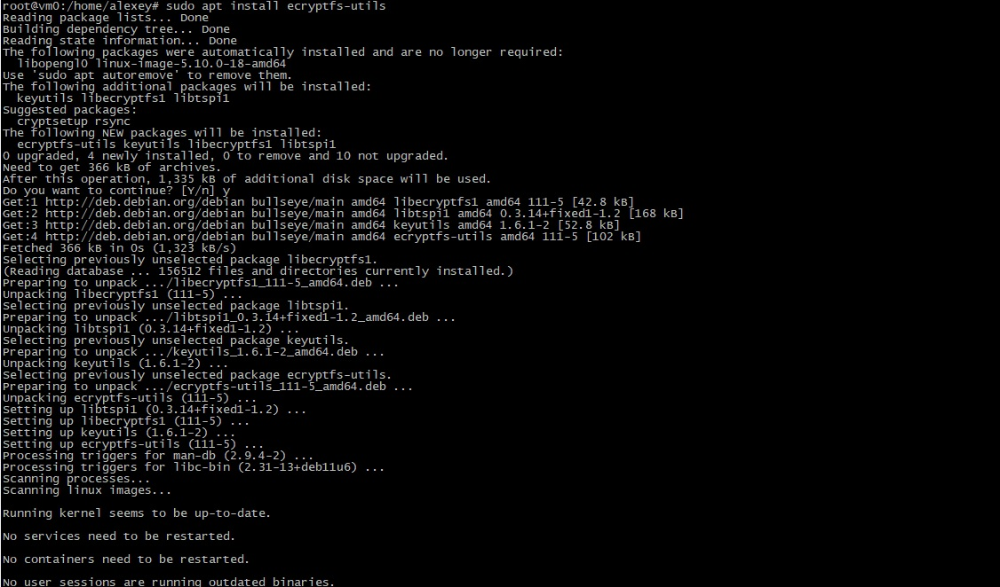
-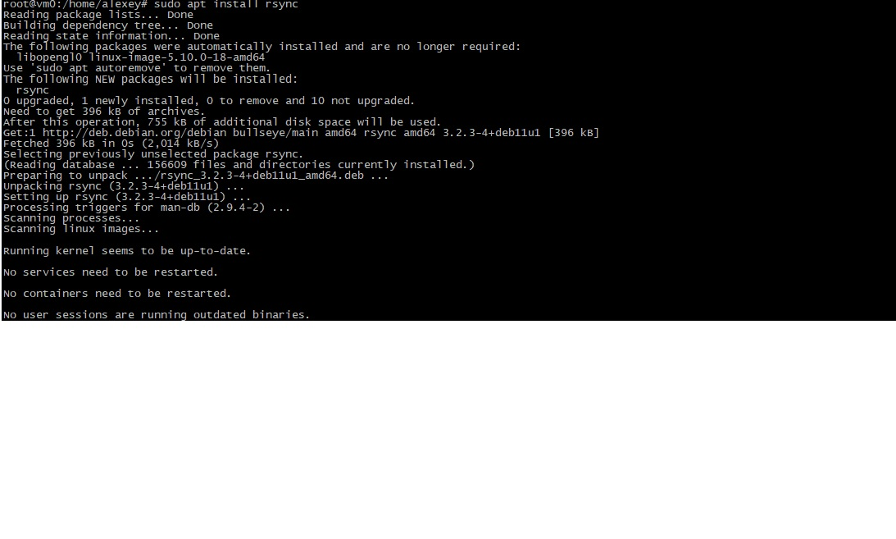

2. `Подключаем модуль ядра`

```
    sudo modprobe ecryptfs
```

3. `Создаём пользователя и шифрованную папку`

```
    sudo adduser --encrypt-home user2
```
`И получаем ошибку:`

-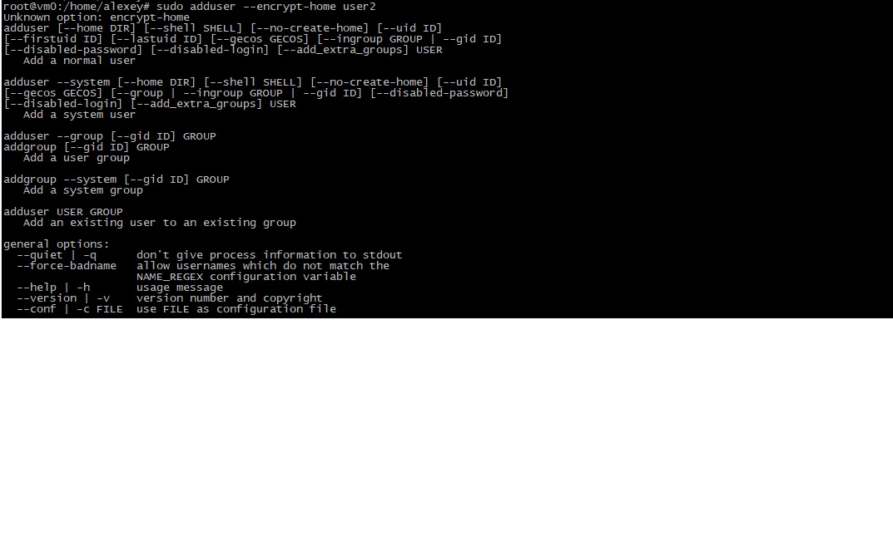


4. `Создаем пользователя`

```
    sudo adduser cryuser
```

5. `Переносим домашний каталог `

```
     sudo ecryptfs-migrate-home -u cryuser
```

-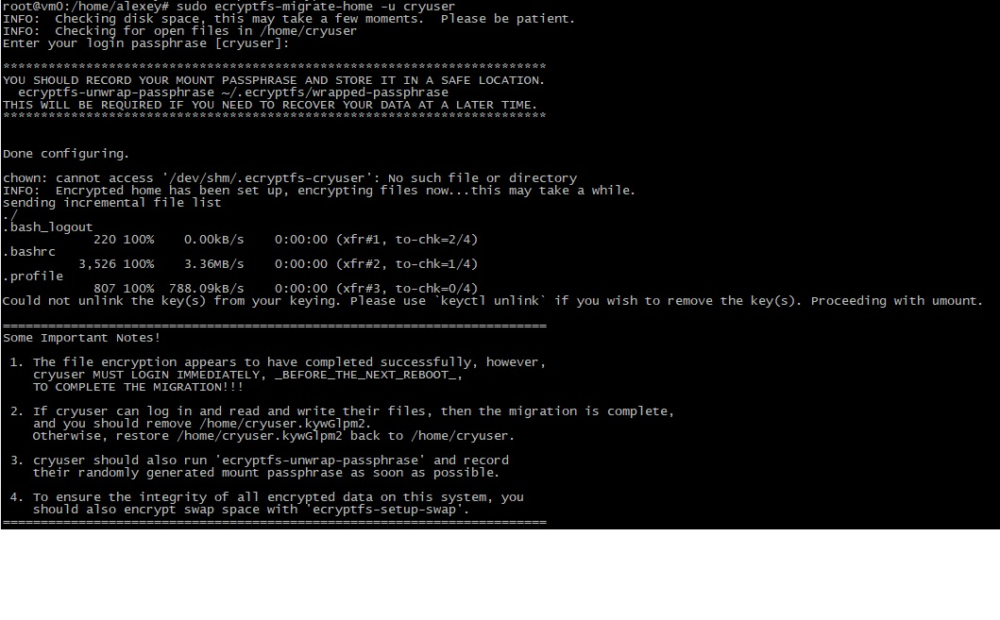

6. `Обязательно логинимся до перезагрузки`

```
    su - cryuser
```


7. `Перезагружаемся и проверяем`

-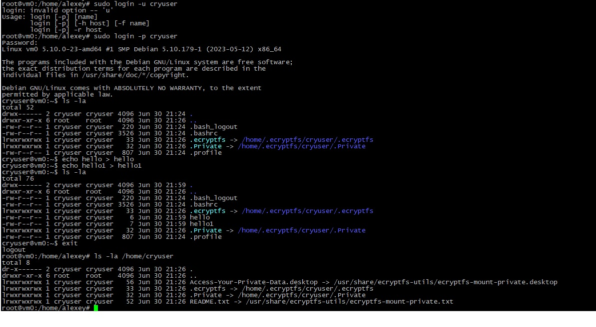


### Задание 2. LUKS.

1. `Ставим gparted и cryptsetup`

```
    sudo apt install gparted cryptsetup
```
-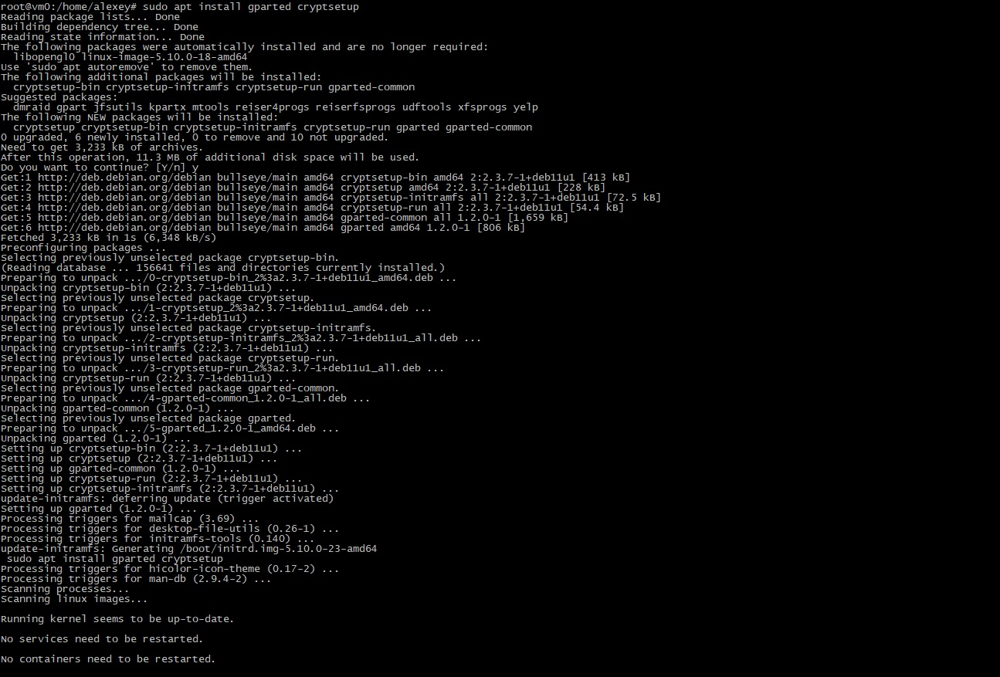

2. `Проверяем установку`

```
    sudo cryptsetup --version
```

3. `Подготавливаем раздел через Gparted`

-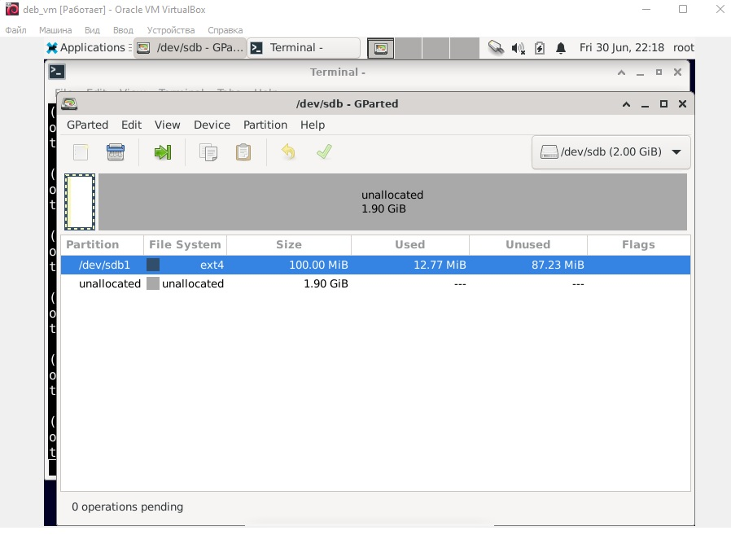

4. `Подготавливаем раздел (при запросе "Вы уверены?" YЕS вводим заглавными(!) буквами, иначе получим ересь в виде "Operation aborted.Command failed with code -1 (wrong or missing parameters)" )`

```
    sudo cryptsetup -y -v --type=luks2 luksFormat  /dev/sdb1
```
-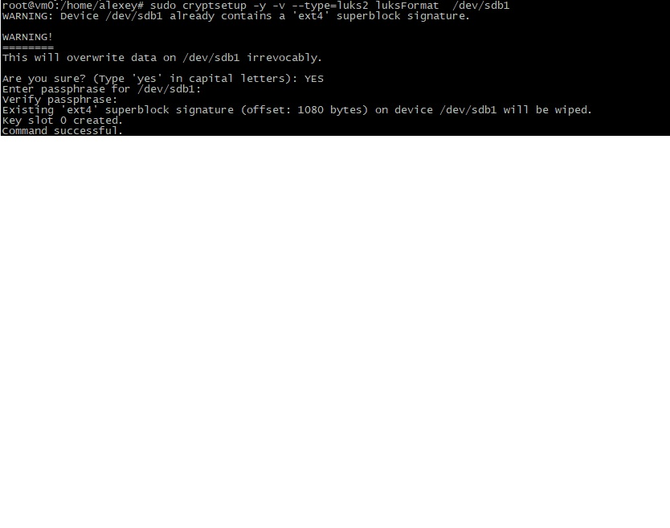

5. `Монтируем раздел`

```
     sudo cryptsetup luksOpen /dev/sdb1 disk
      ls /dev/mapper/disk
```
-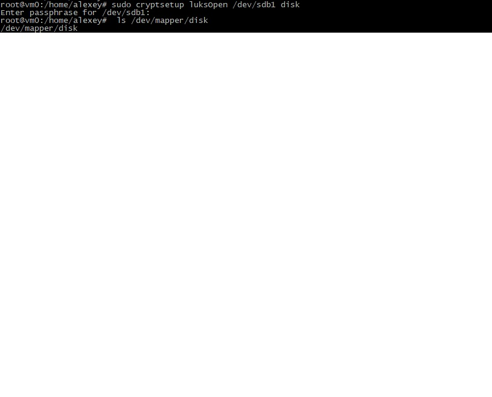

6. `Форматируем раздел`

```
    sudo dd if=/dev/zero of=/dev/mapper/disk
    sudo mkfs.ext4 /dev/mapper/disk
```

-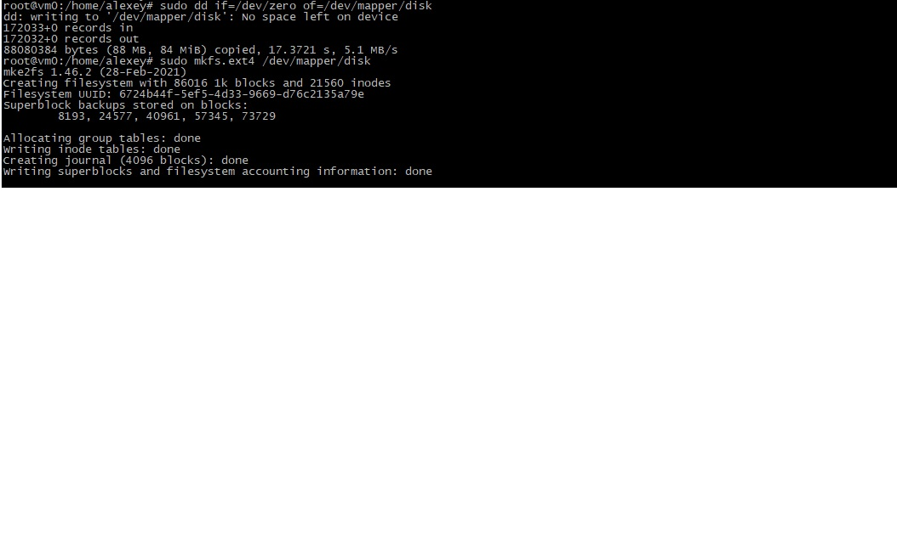

7. `Монтируем открытый раздел`

```
    mkdir .secret
    sudo mount /dev/mapper/disk .secret/
```

-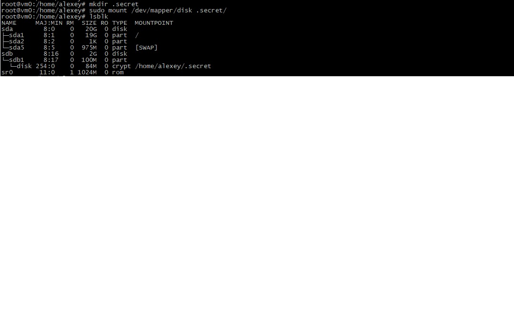


### Задание 3. Apparmor.


1. `Устанавливаем пакеты`

```
    sudo apt install apparmor-profiles apparmor-utils apparmor-profiles-extra
    sudo apparmor_status

```
-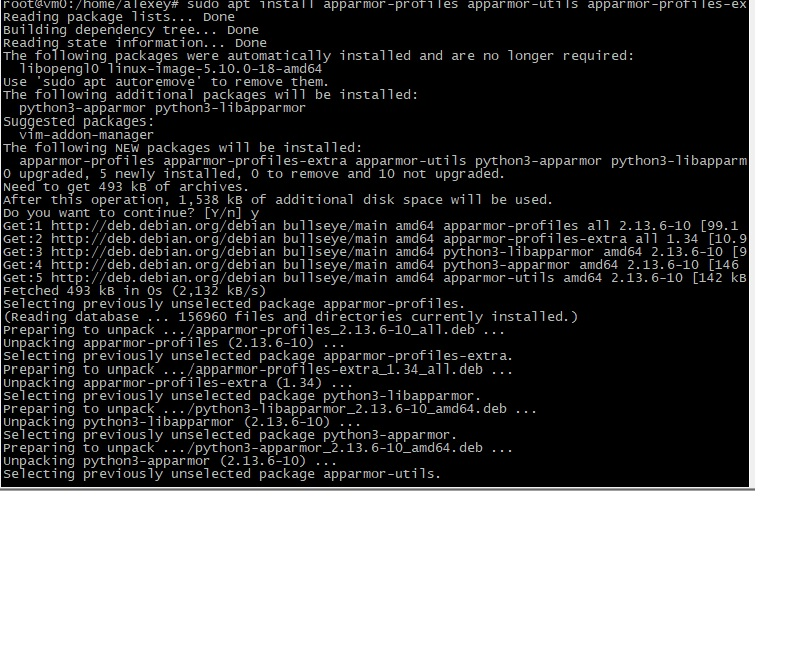
-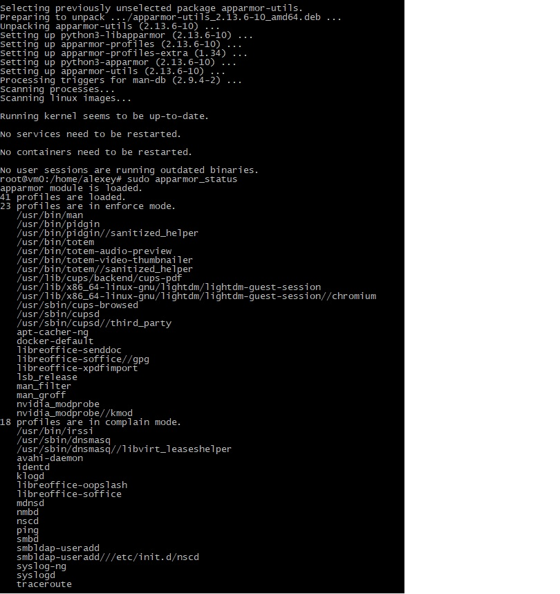

2. `Эксперимент из лекции. В моем случае чтобы через man проходили запросы пришлось включить режим обучения`

-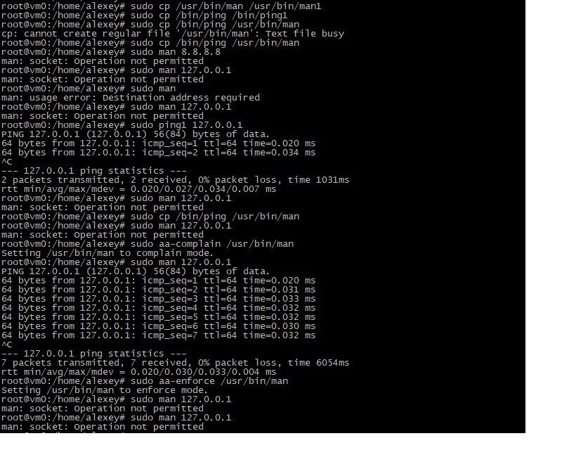

3. `Отключение apparamor`

```
    sudo systemctl stop apparmor
    sudo systemctl disable apparmor
    sudo reboot
```


